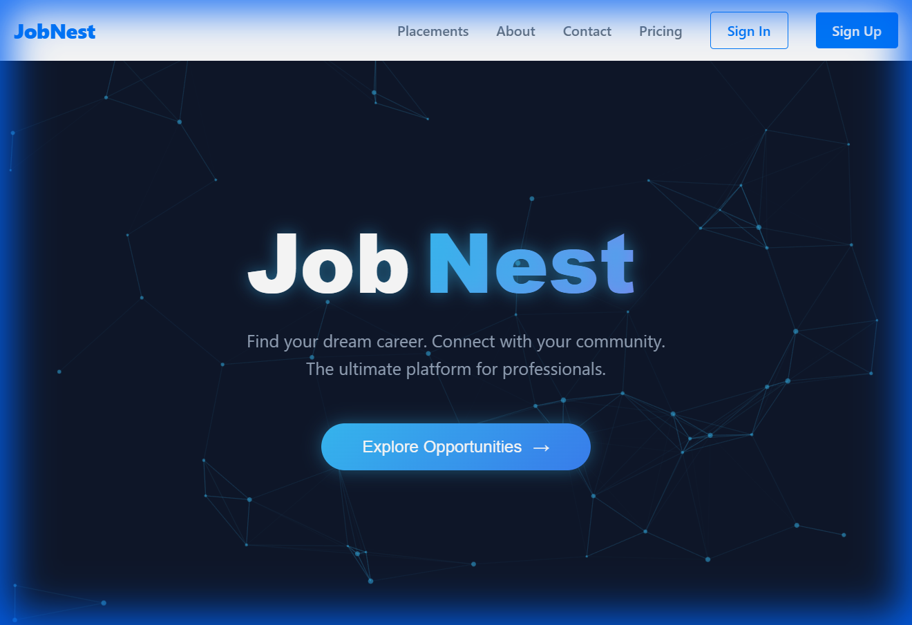
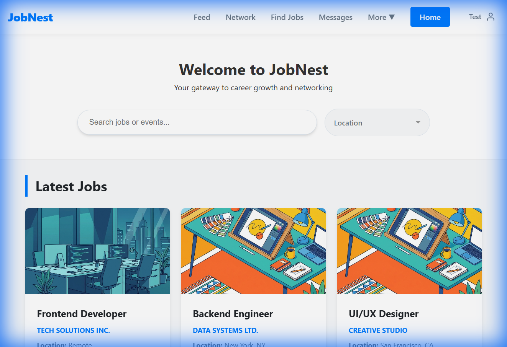
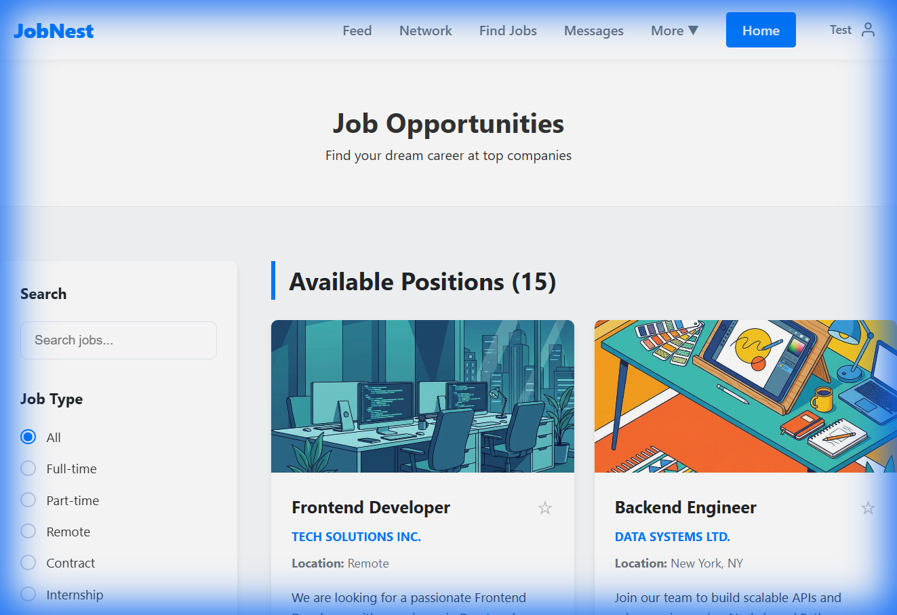

# 🚀 JobNest - Professional Networking & Job Portal

JobNest is a modern, high-performance web application designed to bridge the gap between job seekers and professionals. Built with a focus on interactive design and seamless user experience, it features a dynamic dashboard, real-time networking simulations, and a comprehensive job management system.

---

## 📸 Preview

### 🏠 Landing Page


### 📊 Dashboard & Job Board



---

## ✨ Core Features

- **🎯 Interactive Job Board**: Browse and apply for various roles with a sleek, card-based interface.
- **📅 Event Management**: Discover and track upcoming professional tech summits, meetups, and workshops.
- **🤝 Networking Hub**: Connect with other professionals and grow your career circle.
- **📊 Personalized Dashboard**: Centralized view of your activities, applications, and announcements.
- **✨ Premium UI/UX**: Features interactive particle backgrounds, smooth transitions, and a responsive layout tailored for all devices.
- **💾 Local State Management**: Utilizes `localStorage` for persistent user sessions and navigation states.

## 🛠️ Tech Stack

- **Frontend**:  
- **Styling**: 
- **Interactive Elements**: 
- **Icons**: 

## 🚀 Getting Started

### Prerequisites
- Node.js (v18 or higher)
- npm

### Installation

1. **Clone the repository**
   ```bash
   git clone https://github.com/rev4r0x/JobNest.git
   ```

2. **Navigate to the project directory**
   ```bash
   cd JobNest
   ```

3. **Install dependencies**
   ```bash
   npm install
   ```

4. **Start the development server**
   ```bash
   npm run dev
   ```

## 💡 Usage

### Authentication
- You can explore the landing page without an account.
- To access the **Dashboard**, **Feed**, and **Network**, please Sign Up or Sign In.
- The app uses `localStorage` to remember your session.

### Navigation
- Use the **Navbar** to switch between Jobs, Events, and your Network.
- Click on **Profile** in the navbar to manage your account settings.

## 📱 Responsive Design
JobNest is fully responsive and optimized for:
- Desktop (1440px+)
- Tablets (768px+)
- Mobile devices (425px-)

## 📂 Project Structure

```text
JobNest/
├── docs/                 # Documentation and screenshots
├── src/
│   ├── components/       # UI Components (Navbar, Dashboard, Profile)
│   ├── assets/           # Images and static assets
│   ├── data.js           # Mock data for jobs, events, and users
│   ├── App.jsx           # Main application logic & routing
│   └── App.css           # Global styles and design system
└── index.html            # HTML entry point
```

## 🗺️ Roadmap
- [ ] Real-time Chat integration.
- [ ] Integration with LinkedIn API for profile import.
- [ ] Dark Mode support.
- [ ] Advanced AI-based Job Recommendations.

---
Built with ❤️ by [rev4r0x](https://github.com/rev4r0x)
